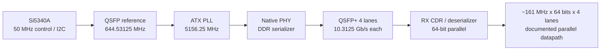

# DE5a QSFP+ 光傳輸

本 repository 整合了本機「02_QSFP 光傳輸」與 Pain 上「/home/b10504072/02_QSFP/」的研究資料，目標是讓沒有參與過本專案的人可以從實驗動機、硬體架構、版本差異、量測證據一路追到目前進度。

專案名稱：DE5a_QSFP  
GitHub remote：git@github.com:t5512355123/DE5a_QSFP.git  
本機整理位置：C:\Users\zenbook\我的雲端硬碟\碩士班研究資料\02_QSFP_git  
Pain 整理位置：/home/b10504072/02_QSFP_git  
本次整理日期：2026-09-15  
來源資料最新研究紀錄：週 03 簡報 QSFP+, P2P Arch. 4/24

## 先看這裡

1. [目前完成度與未完成工作](STATUS.md)
2. [完整實驗時間線](docs/experiment-log.md)
3. [硬體與資料路徑](docs/architecture.md)
4. [驗證矩陣與證據位置](docs/verification-matrix.md)
5. [簡報、PDF、Google Slides 索引](docs/presentation-index.md)

## 目前可確認的成果

- DE5a 使用 Arria 10 GX，器件為 10AX115N2F45E1SG。
- QSFP+ 以 4 lanes、每 lane 10.3125 Gb/s 的名義線速運作，四 lane 名義 aggregate line rate 為 41.25 Gb/s。
- 設計中記錄的 parallel datapath 為約 161 MHz x 64 bits x 4 lanes = 41.216 Gb/s。這是資料路徑寬度與時脈的推導值，不等同於已量測的應用層吞吐量。
- 週 01 找到兩台 DE5a 連線丟包的修正方向，QSFP-A 四條 TX lane 的 Transmitter Pre-Emphasis First Post-Tap Magnitude 設為 18。
- 週 02 改用 Enhanced PCS，處理 64-bit 資料與 PHY 66-bit framing 的落差，使用 tx_enh_fifo_pfull 暫停送資料；簡報記錄的驗證成功率為 100%。
- 週 02 記錄內部 serial loopback latency 為 26 cycles、約 161.2 ns；外部接線條件記錄為 3,895,059 cycles、約 24.15 ms。外部數值包含不同設備 reset time 與銅線 delay，不能直接當作純線材 propagation delay。
- 週 03 以 26-cycle 內部基準與 27-cycle 外部量測相減，記錄銅線額外 delay 為 1 cycle、約 6.2 ns。
- Pain 上已保存四個 Quartus 專案版本：週 01 TX/RX、週 02 Enhanced PCS、週 03 4-port、週 03 JTAG/BRAM。

「100%」只代表週 02 簡報所述的硬體資料驗證案例；目前沒有在來源資料中找到長時間 BER、原始 packet log、PC-to-PC application throughput 或完整 lane deskew 驗證。因此這些項目仍列為後續工作。

## 資料夾結構

    02_QSFP_git/
    ├── README.md                         專案入口與快速導覽
    ├── STATUS.md                         最新狀態、限制與下一步
    ├── CHANGELOG.md                      本 repository 的整理與版本紀錄
    ├── .gitignore                        Quartus 暫存與可重建產物規則
    ├── .gitattributes                    Git LFS 與文字檔換行規則
    ├── docs/
    │   ├── architecture.md               硬體方塊、時脈與速率推導
    │   ├── experiment-log.md             週 01 至週 03 完整實驗敘事
    │   ├── verification-matrix.md        測試條件、結果與證據
    │   ├── presentation-index.md         PPTX、PDF、Google Slides 對照
    │   ├── source-provenance.md          來源、匯入與同步說明
    │   ├── experiments/                  每週可獨立閱讀的摘要
    │   ├── figures/                      從簡報抽出的證據圖與速率圖源
    │   ├── presentations/                原始研究簡報、PDF 與 Slides shortcut
    │   └── sources/                      原始 Guideline 與來源備份
    ├── results/
    │   ├── measurements/                 預留 raw measurement、SignalTap export
    │   └── plots/                        預留整理後的圖與統計
    ├── scripts/                          結構檢查與維護腳本
    └── src/
        ├── quartus/                      Pain 原始 Quartus 樹，保留相對路徑
        │   ├── week01/QSFP_TX_RX/
        │   ├── week02/QSFP_/
        │   └── week03/QSFP_4PORT/、QSFP_JTAG/
        └── simulation/                   目前尚無獨立 simulation testbench

## 如何選擇 Quartus 專案

| 目的 | 建議開啟的專案 | 說明 |
|---|---|---|
| 回看最初的 Standard PCS TX/RX | src/quartus/week01/QSFP_TX_RX/QSFP_TX_RX.qpf | 週 01 baseline，含 18 pre-emphasis 設定 |
| 重現目前最完整的單 QSFP-A datapath | src/quartus/week02/QSFP_/QSFP.qpf | Enhanced PCS、64-bit parallel、FIFO backpressure |
| 查看四個 QSFP 外部 port 整合 | src/quartus/week03/QSFP_4PORT/QSFP_4PORT.qpf | 四 port 結構，4-port 硬體結果需補測 |
| 查看 JTAG/BRAM debug 版本 | src/quartus/week03/QSFP_JTAG/QSFP.qpf | Enhanced PCS 加上 JTAS_RAM 與 In-System Sources and Probes |

每個專案內的 .qpf、.qsf、.qsys、.sdc 與 top-level HDL 都保留原位置。可以在相應專案資料夾直接用 Quartus 開啟 .qpf，不要從 repository 根目錄猜測相對路徑。

## Toolchain 與重建原則

Pain 的已配置 Quartus 執行檔為 /mnt/ds1515/opt/intelFPGA/17.0/quartus/bin/quartus。重建時應優先使用相容的 Quartus Prime 17.0 與對應 Arria 10 IP library。

原始匯入樹保留完整的 db、incremental_db、synth 與報告檔，以便在本機與 Pain 還原當時狀態。Git index 會依 .gitignore 排除可由 Quartus 重新產生的中間檔，但會保留 HDL、QSF/QPF/QSYS/SDC、SignalTap 設定、簡報證據與現成 .sof bitstream。詳情見 [source provenance](docs/source-provenance.md)。

## 速率圖與證據圖

速率推導的 Mermaid 圖源在 [docs/figures/rate-path.mmd](docs/figures/rate-path.mmd)。從簡報抽出的硬體畫面與 SignalTap/Assignment Editor 證據在 [docs/figures/README.md](docs/figures/README.md)。

## 版本控制原則

- 每次修改 HDL、QSF、QSYS 或 SDC 前先建立清楚的 commit。
- commit message 使用「scope: change」格式，例如「week02: gate TX on enhanced PCS FIFO pfull」。
- 硬體結果要同時記錄測試條件、板卡/線材、時間、成功判定方式與原始檔案位置。
- 新增的 raw log 不要只放截圖，優先保存 CSV/JSON/TXT，再放可讀圖。
- 若修改的是簡報內容，保留原始研究檔並在 presentation-index.md 更新版本對照。

## 完整性與限制

本次只整理與補文件，沒有重新編譯 Quartus、重新燒錄 DE5a 或重新執行 P2P/VFIO。文件中的硬體數值來自本機簡報、原始 Guideline 與 Pain 上的 HDL/QSF 設定，並在各節標明「已驗證」、「來源記錄」或「待補測」。
